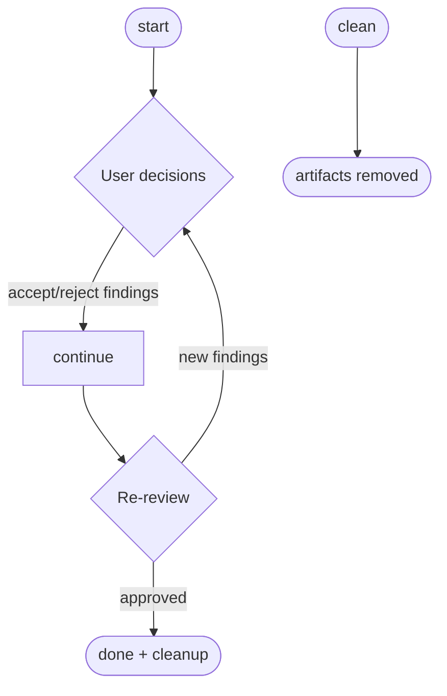

# Code Review Workflow

An AI-driven code review workflow with two modes:

- **Local review** -- reviews uncommitted changes, presents findings for human decision, and iterates until approved or the user declares done.
- **PR review** -- reviews GitHub Pull Requests with deep cross-file analysis and optionally posts findings as GitHub review comments.

## Phase Flow



## Prerequisites

| Tool | Required For | Purpose |
|------|-------------|---------|
| Git | Local review | Diff analysis, branch detection |
| `gh` (GitHub CLI) | PR review | Fetch PR contents, post review comments |

Local review operates entirely on local uncommitted changes with no external services. PR review requires an authenticated `gh` CLI with access to the target repository. If the project has discoverable lint or test commands, they are run during `/continue` to validate changes.

## Phases

### Local Review

| Phase | Command | Purpose | Artifact(s) |
|-------|---------|---------|-------------|
| Start | `/start` | Discover project, review changes, present findings | `00-reviewer-profile.md`, `01-change-summary.md`, `code-review-001.md`, `review-metadata.json`, `decisions-001.json` |
| Continue | `/continue` | Implement accepted changes, re-review | `review-response-{NNN}.md`, `code-review-{NNN}.md`, `decisions-{NNN}.json` |

### PR Review

| Phase | Command | Purpose | Artifact(s) |
|-------|---------|---------|-------------|
| PR | `/pr` | Review a GitHub PR with deep analysis | `pr-review-metadata.json`, `pr-review-001.md` |
| PR Continue | `/pr-continue` | Re-review after author pushes fixes | Updated `pr-review-metadata.json`, `pr-review-{NNN}.md` |

### Shared

| Phase | Command | Purpose | Artifact(s) |
|-------|---------|---------|-------------|
| Clean | `/clean` | Remove artifacts from abandoned reviews | (removes artifact directory) |

## Typical Flow -- Local Review

```text
/start [optional focus guidance]
  -> discovers project conventions (AGENTS.md, linting, CI, etc.)
  -> builds a reviewer profile (cached in artifacts)
  -> analyzes uncommitted changes (tracked modifications and untracked files)
  -> obtains a structured code review
  -> independently assesses each finding
  -> presents a decision table for user approval
  -> user accepts, rejects, or modifies each finding

/continue
  -> implements accepted changes
  -> runs lint/tests if discoverable
  -> writes response documenting changes and rejections
  -> obtains a fresh re-review
  -> presents new findings (if any)
  -> repeat until approved

(on approval, artifacts are cleaned up automatically)

/clean (only for abandoned reviews)
  -> removes .artifacts/code-review/{branch}/
```

## Typical Flow -- PR Review

```text
/pr https://github.com/owner/repo/pull/123
  -> fetches PR metadata, diff, and full file contents via gh
  -> loads existing review comments to avoid duplication
  -> reads project conventions
  -> performs deep cross-file analysis
  -> presents findings conversationally (no severity labels or formal tables)
  -> offers to post findings as GitHub review comments

(author pushes fixes)

/pr-continue
  -> fetches changes since last review (interdiff)
  -> checks what was fixed, what remains, what's new
  -> presents updated findings with progress notes
  -> offers to post follow-up review or approve

(repeat until satisfied)

/clean (optional -- removes .artifacts/code-review/pr-{number}/)
```

## How It Works

### Project Discovery

On first run, the workflow reads the project's AGENTS.md, CLAUDE.md, CONTRIBUTING.md, linting configs, and CI workflows to build a reviewer profile. This profile determines what the reviewer focuses on and what conventions it enforces. No manual initialization needed. Both local and PR review modes use this discovery step.

### Local Review: The Decision Table

After each local review round, findings are presented in a structured table with both the reviewer's finding and the implementor's independent assessment:

```text
| # | Severity | Category | Finding | Implementor Assessment | Recommendation |
|---|----------|----------|---------|----------------------|----------------|
| 1 | HIGH | Correctness | Missing nil check | Agree | Accept |
| 2 | MEDIUM | Conventions | Use constants | Disagree -- already idiomatic | Reject |
```

The user makes the final call on every finding.

### PR Review: Conversational Findings

PR review uses a different presentation model. Findings are presented conversationally without severity labels, formal tables, or implementor assessments. Each finding states what the issue is, why it matters, and what to change. The goal is findings the author would actually fix, not a comprehensive checklist.

PR review also reads full file contents (not just diffs) to catch issues that only emerge from understanding the surrounding code.

### Reviewer Independence

When the AI runtime supports subagents, the local review is performed by a separate agent with its own context. This reduces the tendency to rationalize decisions made during implementation, though a same-model subagent shares the same weights and training biases — it is not equivalent to an independent human reviewer or a different tool. The subagent is strongest at catching mechanical issues: convention violations, obvious bugs, inconsistencies with surrounding code, and missed edge cases.

When subagents are not available, the review is performed sequentially within the same context. The file-based protocol is the same either way.

PR review does not use the dual-role model -- it operates as a single reviewer perspective.

For genuinely independent review, pair this workflow with external tools (e.g., coderabbit) and human reviewers.

### Automatic Cleanup

For local review, when the reviewer approves and the user confirms, all artifacts in `.artifacts/code-review/{branch}/` are removed.

For PR review, cleanup is offered but not automatic -- the user may want to keep the review history across rounds.

The `/clean` command works for both modes as an escape hatch for reviews that are started but never completed.

## Artifacts

### Local Review

Stored in `.artifacts/code-review/{branch}/`:

```text
.artifacts/code-review/feature-xyz/
  00-reviewer-profile.md     (project conventions and review focus)
  01-change-summary.md       (what changed, files affected)
  review-metadata.json       (iteration count, state, timestamps)
  decisions-001.json         (user decisions per round)
  code-review-001.md         (initial review)
  review-response-001.md     (changes made, rejections documented)
  code-review-002.md         (re-review)
  ...
```

### PR Review

Stored in `.artifacts/code-review/pr-{number}/`:

```text
.artifacts/code-review/pr-123/
  pr-review-metadata.json    (PR number, head SHA, round, owner/repo)
  pr-review-001.md           (findings from round 1)
  pr-review-002.md           (findings from round 2, after author pushes)
  ...
```

## Optional Focus Guidance

When starting a review, you can provide focus guidance:

```text
/start focus on error handling and security
/start ignore the test file changes, focus on the API layer
/start this is a refactor -- check for behavioral changes
```

The reviewer will prioritize the specified areas but still report CRITICAL and HIGH findings in other categories.

## Unattended Mode

For a fully automated review cycle (review, fix, iterate, report), add `--unattended`:

```text
/start --unattended
/start --unattended focus on error handling
```

In unattended mode:
- The implementor's value-based recommendations are used as decisions (no user prompts)
- `/continue` is invoked automatically and loops until the reviewer approves
- A summary of all changes across all rounds is presented at the end
- Artifacts are cleaned up automatically on approval

**Safety guardrail:** If the implementor disagrees with a CRITICAL finding, the workflow stops and escalates to the user. A CRITICAL disagreement means the reviewer flagged a must-fix issue but the implementor believes it's a false positive — that judgment call requires a human.

## Directory Structure

```text
code-review/
  SKILL.md                     # Workflow entry point
  guidelines.md                # Behavioral rules and guardrails
  README.md                    # This file
  skills/
    controller.md              # Phase dispatcher and transitions
    start.md                   # Local: project discovery + initial review
    continue.md                # Local: implement changes + re-review
    pr.md                      # PR: deep analysis + optional GitHub posting
    pr-continue.md             # PR: re-review after author pushes fixes
    clean.md                   # Remove abandoned review artifacts
  commands/
    start.md                   # /start command (local review)
    continue.md                # /continue command (local review)
    pr.md                      # /pr command (PR review)
    pr-continue.md             # /pr-continue command (PR re-review)
    clean.md                   # /clean command
```

## Getting Started

```bash
# Install the workflow
./install.sh claude --workflows code-review

# Or install all workflows
./install.sh all
```

**Local review:** Make some changes and run `/start`.

**PR review:** Run `/pr` with a PR URL or number:

```text
/pr https://github.com/owner/repo/pull/123
/pr 123
```

After the author pushes fixes, run `/pr-continue` to re-review.
