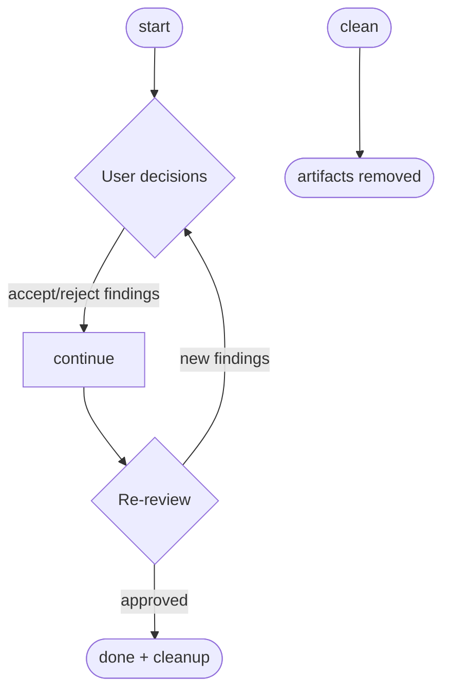

# Code Review Workflow

An AI-driven code review workflow that reviews uncommitted changes, presents findings for human decision, and iterates until approved or the user declares done.

## Phase Flow


```mermaid
graph TD
    start([start]) --> decision{User decisions}
    decision -->|accept/reject findings| continue
    continue --> review{Re-review}
    review -->|new findings| decision
    review -->|approved| done([done + cleanup])
    clean([clean]) --> removed([artifacts removed])
```

## Prerequisites

| Tool | Required | Purpose |
|------|----------|---------|
| Git | Yes | Diff analysis, branch detection |

No external services (Jira, GitHub CLI) are required. The workflow operates entirely on local uncommitted changes. If the project has discoverable lint or test commands, they are run during `/continue` to validate changes.

## Phases

| Phase | Command | Purpose | Artifact(s) |
|-------|---------|---------|-------------|
| Start | `/start` | Discover project, review changes, present findings | `00-reviewer-profile.md`, `01-change-summary.md`, `code-review-001.md`, `review-metadata.json`, `decisions-001.json` |
| Continue | `/continue` | Implement accepted changes, re-review | `review-response-{NNN}.md`, `code-review-{NNN}.md`, `decisions-{NNN}.json` |
| Clean | `/clean` | Remove artifacts from abandoned reviews | (removes artifact directory) |

## Typical Flow

```text
/start [optional focus guidance]
  -> discovers project conventions (AGENTS.md, linting, CI, etc.)
  -> builds a reviewer profile (cached in artifacts)
  -> analyzes uncommitted changes (tracked modifications and untracked files)
  -> obtains a structured code review
  -> independently assesses each finding
  -> presents a decision table for user approval
  -> user accepts, rejects, or modifies each finding

/continue
  -> implements accepted changes
  -> runs lint/tests if discoverable
  -> writes response documenting changes and rejections
  -> obtains a fresh re-review
  -> presents new findings (if any)
  -> repeat until approved

(on approval, artifacts are cleaned up automatically)

/clean (only for abandoned reviews)
  -> removes .artifacts/code-review/{branch}/
```

## How It Works

### Project Discovery

On first run, the workflow reads the project's AGENTS.md, CLAUDE.md, CONTRIBUTING.md, linting configs, and CI workflow filenames to build a reviewer profile. The profile is cached at `.artifacts/code-review/` (not under `{branch}/`) so it survives review cleanup. `.meta.json` includes `skill_version`; a mismatch is a cache miss. The reviewer sees an index and hunk slices, not a dump. If more than 20 files need hunk Reads, remaining files get `--stat` coverage only; those paths are listed in the change summary. No manual initialization needed.

### The Decision Table

After each review round, findings are presented in a structured table with both the reviewer's finding and the implementor's independent assessment:

```text
| # | Severity | Category | Finding | Implementor Assessment | Recommendation |
|---|----------|----------|---------|----------------------|----------------|
| 1 | HIGH | Correctness | Missing nil check | Agree | Accept |
| 2 | MEDIUM | Conventions | Use constants | Disagree -- already idiomatic | Reject |
```

The user makes the final call on every finding.

### Reviewer Independence

When the AI runtime supports subagents, the review is performed by a separate agent with its own context. This reduces the tendency to rationalize decisions made during implementation, though a same-model subagent shares the same weights and training biases — it is not equivalent to an independent human reviewer or a different tool. The subagent is strongest at catching mechanical issues: convention violations, obvious bugs, inconsistencies with surrounding code, and missed edge cases.

When subagents are not available, the review is performed sequentially within the same context. The file-based protocol is the same either way.

For genuinely independent review, pair this workflow with external tools (e.g., coderabbit) and human reviewers.

### Automatic Cleanup

When the reviewer approves and the user confirms, all artifacts in `.artifacts/code-review/{branch}/` are removed. The `/clean` command exists only as an escape hatch for reviews that are started but never completed.

## Artifacts

Review artifacts for a given branch live in
`.artifacts/code-review/{branch}/`. The reviewer-profile cache
(`_reviewer-profile.md` and `.meta.json`) lives at
`.artifacts/code-review/` (workflow root, not under `{branch}/`) so it
survives cleanup. Do not place or remove the cache under the branch
directory.

```text
.artifacts/code-review/
  _reviewer-profile.md       (cached profile; reused while sources match)
  .meta.json
  feature-xyz/
    00-reviewer-profile.md   (project conventions and review focus)
    01-change-summary.md     (what changed, files affected, stat-only coverage)
    diff-index-001.json      (name-status + hashes; compared on re-review)
    review-metadata.json     (iteration count, state, timestamps)
    decisions-001.json       (user decisions per round)
    code-review-001.md       (initial review)
    review-response-001.md   (changes made, rejections documented)
    code-review-002.md       (re-review)
    ...
```

## Optional Focus Guidance

When starting a review, you can provide focus guidance:

```text
/start focus on error handling and security
/start ignore the test file changes, focus on the API layer
/start this is a refactor -- check for behavioral changes
```

The reviewer will prioritize the specified areas but still report CRITICAL and HIGH findings in other categories.

## Unattended Mode

For a fully automated review cycle (review, fix, iterate, report), add `--unattended`:

```text
/start --unattended
/start --unattended focus on error handling
```

In unattended mode:
- The implementor's value-based recommendations are used as decisions (no user prompts)
- `/continue` is invoked automatically and loops until the reviewer approves
- A summary of all changes across all rounds is presented at the end
- Artifacts are cleaned up automatically on approval

**Safety guardrail:** If the implementor disagrees with a CRITICAL finding, the workflow stops and escalates to the user. A CRITICAL disagreement means the reviewer flagged a must-fix issue but the implementor believes it's a false positive — that judgment call requires a human.

## Directory Structure

```text
code-review/
  SKILL.md                     # Workflow entry point
  guidelines.md                # Behavioral rules and guardrails
  README.md                    # This file
  skills/
    controller.md              # Phase dispatcher and transitions
    start.md                   # Project discovery + initial review
    continue.md                # Implement changes + re-review
    clean.md                   # Remove abandoned review artifacts
  commands/
    start.md                   # /start command
    continue.md                # /continue command
    clean.md                   # /clean command
  templates/
    00-reviewer-profile.md     # Reviewer profile skeleton
    01-change-summary.md       # Change summary skeleton
    code-review.md             # Review round skeleton
```

## Getting Started

```bash
# Install the workflow
./install.sh claude --workflows code-review

# Or install all workflows
./install.sh all
```

Then in your project, make some changes and run the `code-review` workflow's `start` command.
