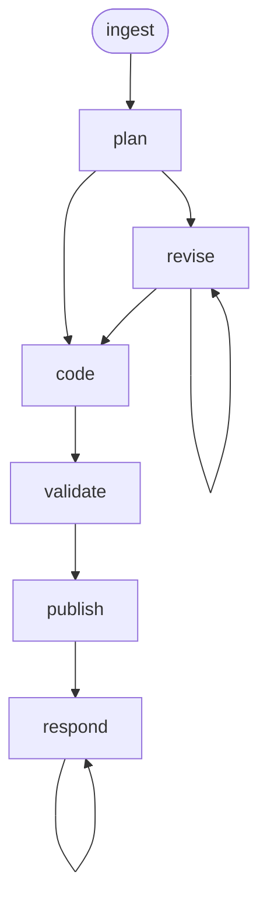

<!-- Edited by Claude Code -->
# E2E Testing

A story-to-tests workflow that takes a Jira \[QE\] Story, discovers the project's e2e testing infrastructure, plans test scenarios mapped to acceptance criteria, writes e2e test code, and manages review via GitHub PRs.

## Phase Flow



## Prerequisites

| Tool | Required | Purpose |
|------|----------|---------|
| Jira access (MCP or CLI) | For `/ingest` | Fetch \[QE\] Story issue details |
| GitHub CLI (`gh`) | For `/publish`, `/respond` | Create PRs, post review comments |
| Git | Yes | Branch management, commits |
| Project e2e test tooling | Yes | Discovered during `/ingest` |

## Phases

| Phase | Command | Purpose | Artifact(s) |
|-------|---------|---------|-------------|
| Ingest | `/ingest` | Fetch \[QE\] story, explore e2e infrastructure | `01-context.md` |
| Plan | `/plan` | Map ACs to test scenarios | `02-plan.md` |
| Revise | `/revise` | Incorporate feedback into test plan | Updated `02-plan.md` |
| Code | `/code` | Write e2e test code | `03-test-report.md`, `04-impl-report.md` |
| Validate | `/validate` | Run tests, check anti-patterns | `05-validation-report.md` |
| Publish | `/publish` | Push branch, create draft PR | `06-pr-description.md` |
| Respond | `/respond` | Address reviewer comments | `07-review-responses.md` |

## Key Design Decisions

### Discovery-Based Infrastructure

The workflow does not hardcode language-specific commands or framework assumptions. During `/ingest`, it discovers the project's e2e testing framework, abstractions, auxiliary services, execution commands, and conventions. Portable across Ginkgo, Playwright, pytest, Cypress, Jest, etc.

### Reference Suite Pattern

Before writing any test code, the workflow identifies the most similar existing e2e test suite and extracts its patterns: imports, lifecycle hooks, assertion style, labels, cleanup.

### Scenario-Driven Planning

Each acceptance criterion maps to one or more concrete test scenarios with specific steps, assertions, and labels.

### Anti-Pattern Detection

Validation checks for 10 common e2e test anti-patterns: hardcoded sleeps, brittle selectors, order-dependent tests, shared mutable state, missing cleanup, missing labels, hardcoded values, and more.

## Artifacts

```text
.artifacts/e2e/{jira-key}/
  01-context.md
  02-plan.md
  03-test-report.md
  04-impl-report.md
  05-validation-report.md
  06-pr-description.md
  07-review-responses.md
  publish-metadata.json
```

## Getting Started

```bash
./install.sh claude --workflows e2e
```
