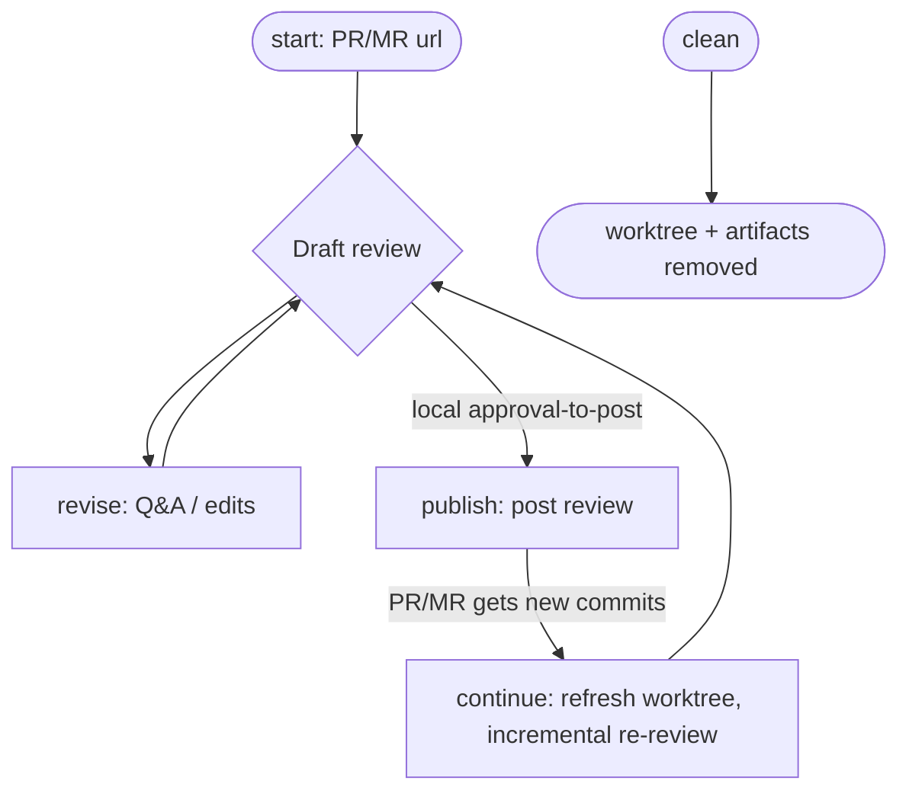

# PR Review Workflow

An AI-driven review of a remote GitHub pull request or GitLab merge request,
given its URL. Checks the PR/MR out into a disposable git worktree, always
explains its context before critiquing it, and drafts inline review comments
(links, snippets, suggestion blocks) in a suggestive, pluggable tone. Nothing
is posted until the local user explicitly approves the exact draft content —
this workflow never changes the reviewed code and never performs a
host-level PR/MR approval.

## Phase Flow



## Prerequisites

| Tool | Required | Purpose |
|------|----------|---------|
| Git | Yes | Worktree setup, diff analysis |
| `gh` (GitHub CLI), authenticated | For GitHub PRs | Fetch PR metadata/comments, post the review |
| `glab` (GitLab CLI), authenticated | For GitLab MRs | Fetch MR metadata/discussions, post comments |

The provider is auto-detected from the URL — you only need whichever CLI
matches the PR/MR you're reviewing.

## Phases

| Phase | Command | Purpose | Artifact(s) |
|-------|---------|---------|-------------|
| Start | `/start {url}` | Detect provider, check out a worktree, gather PR/MR context, draft a review | `00-reviewer-profile.md`, `01-pr-context.md`, `02-draft-review-001.md`, `review-metadata.json`, `decisions-001.json` |
| Revise | `/revise` | Answer questions, apply edits, add user findings, re-present | `02-draft-review-{NNN}.md`, `decisions-{NNN}.json` |
| Publish | `/publish` | Post the approved draft as inline review comments | `publish-metadata.json` |
| Continue | `/continue` | After new commits, refresh the worktree and draft the incremental review | Updated `01-pr-context.md`, `02-draft-review-{NNN}.md`, `decisions-{NNN}.json` |
| Clean | `/clean` | Remove the worktree, scratch clone (if any), and all artifacts | (removes worktree + artifact directory) |

## Typical Flow

```text
/start https://github.com/{owner}/{repo}/pull/{n}
  (or a GitLab MR URL — provider is auto-detected)
  -> checks out the PR/MR into a git worktree
  -> gathers PR/MR context (title, author, linked issues, key decisions,
     existing discussion) and always shows it first
  -> builds a reviewer profile from the target project's own conventions
  -> obtains a structured review, extended with permalinks, snippets, and
     suggestion blocks for every finding
  -> independently assesses each finding
  -> drafts inline comments in a suggestive tone
  -> presents the full draft for local approval-to-post

/revise (repeatable)
  -> answers your questions about specific comments
  -> applies edits you request (reword, drop, change suggestions)
  -> drafts any new findings you describe
  -> re-presents the updated draft

/publish (only after you approve posting)
  -> posts the review as inline comments on the host
  -> worktree is left in place — nothing is torn down here

/continue (after the PR/MR receives new commits)
  -> refreshes the same worktree in place
  -> reviews only what's new, notes which prior comments look addressed
  -> feeds back into /revise -> /publish

/clean (once you're fully done with this PR/MR)
  -> the only phase that removes the worktree, branch/scratch-clone, and
     artifacts
```

## How It Works

### Approve-to-Post, Not PR Approval

"Approve," everywhere in this workflow, means the local user signing off in
chat on the exact draft content so `/publish` may post it. It is unrelated
to — and this workflow never performs — a host-level PR/MR approval. Every
posted GitHub review uses `event: COMMENT` (never `APPROVE`/
`REQUEST_CHANGES`); the GitLab approve/unapprove endpoint is never called.

### Context Before Critique

Every session starts by writing and presenting `01-pr-context.md`: title,
author, base↔head, linked issues, a commit narrative, inferred design
decisions, and a summary of existing discussion. Findings are never shown
without this context first.

### Findings Extended for Posting

Beyond the standard finding format from `../_shared/review-protocol.md`,
every kept finding here also carries:

- A **permalink** to the exact line(s) at the PR/MR's head SHA
- The **quoted snippet** at that location
- A **suggested-change block** (a fenced ` ```suggestion ` block) when the
  fix is a concrete, mechanical replacement — omitted for conceptual or
  design-level findings

### Pluggable Comment Style

Posted tone and structure default to suggestive framing ("Should we...",
never "Do X") with no severity/category labels or "Finding N" headers, and
a fixed `See comments below` review summary — see
`templates/comment-style.md`. A reviewed project can override this by
committing its own `.pr-review/templates/comment-style.md`.

### The Worktree Persists Until `/clean`

Unlike a typical scratch worktree, this one is **not** torn down after
`/publish`. It stays in place so `/continue` can refresh it (fetch + reset)
instead of re-cloning from scratch, across as many review rounds as the
PR/MR goes through. Only `/clean` removes it — run it once you're done
reviewing a given PR/MR.

### GitHub vs. GitLab

The workflow is almost entirely generic `git` operations plus prose review
logic. Only a few touchpoints talk to the host directly:

| Touchpoint | GitHub (`gh`) | GitLab (`glab`) |
|---|---|---|
| Detect provider | URL path is `/pull/{n}` | URL path is `/-/merge_requests/{n}` |
| Fetch PR/MR metadata | `gh pr view` | `glab mr view` / `glab api` |
| Fetch the worktree ref | `refs/pull/{n}/head` | `refs/merge-requests/{n}/head` |
| List existing comments | `gh api .../pulls/{n}/comments` + `.../reviews` | `glab api .../discussions` |
| Post the review | One batched review via `gh api .../pulls/{n}/reviews` | One discussion per comment via `glab api .../discussions`, plus a separate summary note |

Everything else — worktree setup, diff analysis, reviewer profile
discovery, finding drafting, tone/style, the revise loop — has no provider
branching at all.

## Artifacts

All artifacts and the worktree are stored in
`.artifacts/pr-review/{context}/`, where `{context}` is a sanitized
`{owner-or-namespace}-{repo-or-project}-{number}`.

```text
.artifacts/pr-review/openai-example-repo-1234/
  00-reviewer-profile.md      (target project's conventions and review focus)
  01-pr-context.md            (title, author, linked issues, key decisions, existing discussion)
  review-metadata.json        (provider, refs, iteration, state, timestamps)
  decisions-001.json          (local decisions per round)
  02-draft-review-001.md      (draft review, round 1)
  02-draft-review-002.md      (draft review, round 2 — after /revise or /continue)
  ...
  publish-metadata.json       (record of what was posted, once /publish runs)
  worktree/                   (git worktree checked out at the PR/MR head)
  _scratch-repo/              (only if no local clone of the target repo could be reused)
```

## Directory Structure

```text
pr-review/
  SKILL.md                     # Workflow entry point
  guidelines.md                # Behavioral rules and hard limits
  README.md                    # This file
  templates/
    comment-style.md           # Default tone/structure — pluggable
  skills/
    controller.md               # Phase dispatcher and transitions
    start.md                    # URL parsing, worktree setup, context, initial draft
    revise.md                   # Q&A, edits, user-added findings
    publish.md                  # Post the approved review
    continue.md                 # Refresh worktree, incremental re-review
    clean.md                    # Remove worktree + artifacts
  commands/
    start.md                    # /start command
    revise.md                   # /revise command
    publish.md                  # /publish command
    continue.md                 # /continue command
    clean.md                    # /clean command
```

## Getting Started

```bash
# Install the workflow
./install.sh claude --workflows pr-review

# Or install all workflows
./install.sh all
```

Then run the `pr-review` workflow's `start` command with a PR or MR URL:

```text
/start https://github.com/{owner}/{repo}/pull/{number}
/start https://gitlab.com/{namespace}/{project}/-/merge_requests/{number}
```
