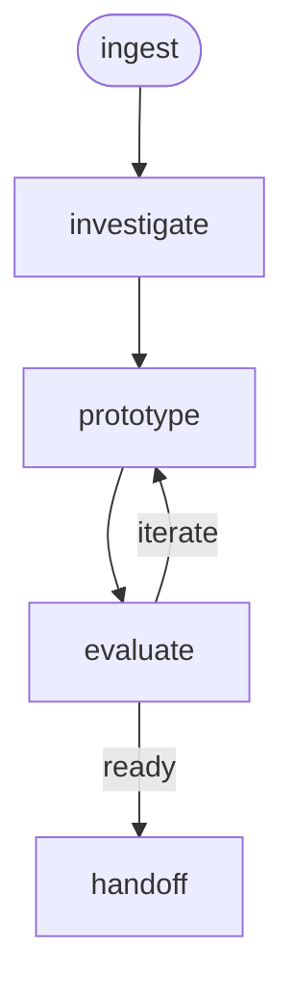

# Research Workflow

A UX research workflow that takes a feature request through discovery, user research, prototyping, and heuristic evaluation to produce a validated design handoff artifact for implementation.

## Phase Flow



## Prerequisites

| Tool | Required | Purpose |
|------|----------|---------|
| Jira access (MCP or CLI) | For `/ingest` | Fetch issue details for problem framing |
| UXD marketplace plugins | For `/prototype`, `/evaluate` | Prototyping and heuristic evaluation |

## Phases

| Phase | Command | Purpose | Artifact(s) |
|-------|---------|---------|-------------|
| Ingest | `/ingest` | Frame the problem, identify user groups, survey landscape | `01-discovery.md` |
| Investigate | `/investigate` | Conduct user research, synthesize findings | `02-research.md` |
| Prototype | `/prototype` | Generate design prototypes from research | `03-prototype/` |
| Evaluate | `/evaluate` | Heuristic evaluation and usability assessment | `04-evaluation.md` |
| Handoff | `/handoff` | Produce implementation-ready design spec | `05-handoff.md` |

## Typical Flow

```text
/ingest EDM-1234
  → frames the problem, identifies user groups
  → surveys competitive landscape
  → writes .artifacts/research/EDM-1234/01-discovery.md

/investigate
  → conducts user research (interviews, surveys, analytics)
  → synthesizes findings into themed insights
  → writes 02-research.md

/prototype
  → generates design prototypes informed by research
  → uses uxd-prototype-create skill when available
  → writes 03-prototype/ (files + prototype-notes.md)

/evaluate
  → runs heuristic evaluation against prototype
  → uses uxd-research-heuristic-eval skill when available
  → writes 04-evaluation.md
  → loops back to /prototype if critical issues found

/handoff
  → synthesizes all artifacts into implementation spec
  → maps UI elements to design system components
  → writes 05-handoff.md
```

## Artifacts

All artifacts are stored in `.artifacts/research/{issue-key}/`.

```text
.artifacts/research/EDM-1234/
  01-discovery.md              (problem framing, user groups, landscape)
  02-research.md               (research findings, insights, recommendations)
  03-prototype/                (prototype files, design rationale)
    prototype-notes.md         (design decisions, user stories covered)
  04-evaluation.md             (heuristic eval report, readiness assessment)
  05-handoff.md                (implementation spec, component mapping, AC)
```

## UXD Marketplace Skills

This workflow uses skills from the [UXD AI Skills marketplace](https://github.com/rh-uxd/ai-helpers). All skills degrade gracefully — the workflow functions without them.

| Skill | Plugin | Used by |
|-------|--------|---------|
| `uxd-research-heuristic-eval` | `uxd-workshop` | `/evaluate` |
| `uxd-evaluate-design-heuristics` | `uxd-workshop` | `/evaluate` |
| `uxd-prototype-evaluate` | `uxd-workshop` | `/evaluate` |
| `uxd-prototype-create` | `uxd-workshop` | `/prototype` |
| `uxd-figma-read` | `uxd-workshop` | `/prototype` |

## Directory Structure

```text
research/
├── SKILL.md                    # Workflow entry point
├── guidelines.md               # Behavioral rules and guardrails
├── README.md                   # This file
├── skills/
│   ├── controller.md           # Phase dispatcher and transitions
│   ├── ingest.md               # Frame problem, identify user groups
│   ├── investigate.md          # Conduct user research
│   ├── prototype.md            # Generate design prototypes
│   ├── evaluate.md             # Heuristic evaluation
│   └── handoff.md              # Design-to-implementation spec
└── commands/
    ├── ingest.md               # /ingest command
    ├── investigate.md          # /investigate command
    ├── prototype.md            # /prototype command
    ├── evaluate.md             # /evaluate command
    └── handoff.md              # /handoff command
```

## Getting Started

```bash
# Install the workflow
./install.sh claude --workflows research

# Or install all workflows
./install.sh all
```

Then in your project, run the `research` workflow's `ingest` command for your Jira issue or feature description.
