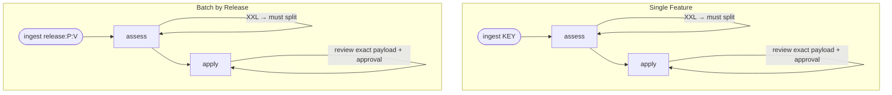

# Sizing Workflow

A pre-cycle Feature sizing workflow that assesses Jira Features using T-shirt sizes (XS–XXL), produces per-team effort breakdowns (DEV, QE, UX, UI, DOCS), classifies each Feature on an impact-vs-effort quadrant for prioritization, and writes results back to Jira. Supports single-Feature and batch (Fix Version) modes.

## Phase Flow



## Prerequisites

| Tool | Required | Purpose |
|------|----------|---------|
| Jira read access | Yes | Configured Jira CLI, or `JIRA_URL` and `JIRA_TOKEN` for REST retrieval |
| Jira write integration | To complete `/apply` writes | Apply explicitly approved Size and comment actions |
| Git | Yes | Codebase exploration |
| Python 3.10+ | Yes | Run the deterministic sizing helper scripts |

## Command Syntax

Examples in this document use bare phase names (`/ingest`, `/assess`, `/apply`).
The actual invocation syntax depends on your AI tool — e.g., `/sizing:ingest`
in Claude Code, `/sizing-ingest` in Cursor. See your tool's documentation for
the exact command format.

## Phases

| Phase | Command | Purpose | Artifact(s) |
|-------|---------|---------|-------------|
| Ingest | `/ingest` | Fetch compact Jira data, explore codebase | `01-context.json`, `01-context.md` |
| Assess | `/assess` | Judge sizing, validate and calculate recommendations | `02-decisions.json`, `02-assessment.json`, `02-assessment.md` |
| Apply | `/apply` | Review exact size/comment payloads, then write approved updates to Jira | `03-apply-actions.json` |

## Input Modes

### Single Feature

```text
/ingest EDM-2324
```

Sizes a single Feature.

### Batch by Release

```text
/ingest release:EDM:1.3.0
```

Fetches all Features in the specified project and Fix Version, sizing them together for relative calibration. Format: `release:{project}:{version}`.

## Typical Flow

```text
/ingest EDM-2324
  → Python captures and compacts Jira data; raw API JSON stays out of model context
  → explores affected codebase areas and summarizes requirements
  → writes .artifacts/sizing/EDM-2324/01-context.json
  → Python renders .artifacts/sizing/EDM-2324/01-context.md

/assess
  → reads 01-context.json and the Feature sizing rubric
  → writes compact model judgments to 02-decisions.json
  → Python validates and calculates scores, rankings, quadrants, and aggregates
  → Python writes 02-assessment.json and renders 02-assessment.md

/apply
  → Python renders a selection preview and prepares exact size/comment actions
  → user reviews the generated comments and explicitly approves the action payload
  → the configured Jira integration writes the Size field (customfield_10795)
    and team breakdown comment
```

### Batch Flow

```text
/ingest release:EDM:1.3.0
  → fetches all Features in project EDM with fixVersion = "1.3.0"
  → shares code evidence across Features and writes compact 01-context.json
  → Python renders 01-context.md

/assess
  → writes compact per-Feature judgments to 02-decisions.json
  → calibrates batch sizes and notes capacity concerns
  → Python computes derived values and renders the summary and per-Feature detail

/apply
  → previews sizes and prepares selected Jira payloads
  → user can exclude specific Features
  → user reviews full generated comments and approves the exact action payload
  → writes approved sizes and comments to Jira
```

## Artifacts

All artifacts are stored in `.artifacts/sizing/{context}/` where context is
the Feature key (single mode) or a kebab-case Fix Version slug (batch mode).

```text
.artifacts/sizing/EDM-2324/          (single mode)
  01-context.json                    (compact context used by assessment)
  01-context.md                      (rendered Feature context)
  02-decisions.json                  (AI sizing judgments)
  02-assessment.json                 (validated judgments + derived values)
  02-assessment.md                   (rendered sizing recommendation)
  03-apply-actions.json              (prepared actions before write approval)

.artifacts/sizing/1-5/               (batch mode, Fix Version "1.5")
  01-context.json                    (all compact Feature contexts)
  01-context.md                      (rendered Feature contexts)
  02-decisions.json                  (AI judgments + batch calibration)
  02-assessment.json                 (validated judgments + batch calculations)
  02-assessment.md                   (rendered summary + per-Feature detail)
  03-apply-actions.json              (prepared actions before write approval)
```

## Size Scale

| Size | Duration | Meaning |
|------|----------|---------|
| XS | Up to 2 days | Minimal scope, well-understood change |
| S | Up to 1 week | Narrow scope, low risk |
| M | ~1–2 weeks | Moderate scope, multiple can coexist |
| L | Up to ~3 weeks | Roughly half the dev phase |
| XL | ~4–6 weeks | Most of a cycle |
| XXL | — | Must split before committing |

See `../_shared/sizing-rubric.md` for the full rubric including heuristics and
team effort guidance.

## Directory Structure

```text
sizing/
├── SKILL.md                    # Workflow entry point
├── guidelines.md               # Behavioral rules and guardrails
├── README.md                   # This file
├── skills/
│   ├── dispatch.md             # Lightweight explicit-phase dispatcher
│   ├── completion.md           # Next-step guidance after a phase
│   ├── controller.md           # Default-input discovery and routing
│   ├── ingest.md               # Fetch Features, explore codebase
│   ├── assess.md               # Apply rubric, produce recommendations
│   └── apply.md                # Write sizes to Jira
├── scripts/
│   ├── _common.py              # Shared JSON, path, Markdown, and transaction helpers
│   ├── prepare_context.py      # Capture and compact Jira Feature data
│   ├── render_context.py       # Validate and render context artifacts
│   ├── finalize_assessment.py  # Validate judgments, compute, and render
│   ├── apply_plan.py           # Preview and prepare Jira update payloads
│   └── test_sizing_scripts.py  # Tests for deterministic sizing helpers
└── commands/
    ├── ingest.md               # /ingest command
    ├── assess.md               # /assess command
    └── apply.md                # /apply command
```

## Getting Started

```bash
# Install the workflow
./install.sh claude --workflows sizing

# Or install all workflows
./install.sh all
```

Then run the sizing workflow's `ingest` command with a Feature key or Fix Version.
