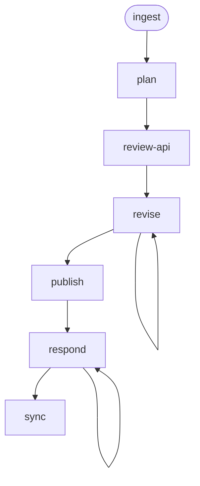

# UI Design Workflow

A UI design workflow that takes a `[UI]` Jira story and UX handoff artifact, produces a component decomposition with hook design, state management approach, route structure, and data flow mapping, reviews the API surface for gaps, publishes the design for review, and syncs `[DEV]` stories for backend work to Jira.

## Pipeline Position

```text
prd → design → ux-design → ui-design (this) → ui-implement (future)
```

The `ui-design` workflow consumes the published UX handoff (`05-handoff.md`) and design document from the docs repo. Its output (`02-ui-design.md`) is the contract for the future `ui-implement` workflow.

## Phase Flow



## Prerequisites

| Tool | Required | Purpose |
|------|----------|---------|
| Jira access (MCP or CLI) | For `/ingest`, `/sync` | Fetch `[UI]` story, create `[DEV]` stories |
| Docs repository (configured) | For `/ingest`, `/publish` | Load upstream PRD, design doc, UX handoff; publish UI design |
| GitHub CLI (`gh`) | For `/publish`, `/respond` | Create PRs, post review comments |
| Git | Yes | Branch management, commits |

## Inputs

The workflow draws from multiple published sources — never from another workflow's private `.artifacts/` directory:

| Input | Source | Required |
|-------|--------|----------|
| `[UI]` Jira story | Jira | Yes |
| UX handoff (`05-handoff.md`) | Docs repo (from `ux-design` workflow) | No — optional for purely technical work |
| PRD (`prd.md`) | Docs repo (from `prd` workflow) | Yes |
| Design document (`design.md`) | Docs repo (from `design` workflow) | Yes |
| `AGENTS.md` / `UI-ARCHITECTURE.md` | Project root | If available |
| Backend API types and endpoints | Source codebase | Explored during `/ingest` |

## Phases

| Phase | Command | Purpose | Artifact(s) |
|-------|---------|---------|-------------|
| Ingest | `/ui-design:ingest` | Fetch story, load upstream docs, explore UI codebase and backend API | `01-context.md` |
| Plan | `/ui-design:plan` | Component decomposition, hook design, state management, route structure, data flow mapping | `02-ui-design.md` |
| Review API | `/ui-design:review-api` | Deep API surface review — map every UI data need to endpoints/fields, categorize gaps | `02-ui-design.md` (updated) or `03-api-findings.md` |
| Revise | `/ui-design:revise` | Incorporate feedback | Updated `02-ui-design.md` |
| Publish | `/ui-design:publish` | Push UI design document to docs repo as a draft PR | `04-pr-description.md`, `publish-metadata.json` |
| Respond | `/ui-design:respond` | Address PR reviewer comments | `05-review-responses.md`, updated `02-ui-design.md` |
| Sync | `/ui-design:sync` | Create/update/close `[DEV]` stories for API gaps | `sync-manifest.json` |

## Typical Flow

```text
/ui-design:ingest EDM-1234
  → fetches the [UI] story from Jira
  → follows references to load UX handoff, PRD, design doc from docs repo
  → reads AGENTS.md, UI-ARCHITECTURE.md
  → explores UI codebase (components, hooks, routes, state, tests)
  → explores backend API (types, endpoints, OpenAPI specs)
  → writes .artifacts/ui-design/EDM-1234/01-context.md

/ui-design:plan
  → reads context and UX handoff data annotations
  → decomposes into component architecture (tree, new vs reused, props)
  → designs custom hooks and data-fetching patterns
  → selects state management approach (local vs global, scope justification)
  → maps route structure (new routes, lazy loading, guards)
  → resolves UX data annotations to actual API endpoints and fields
  → documents persona-aware decomposition (shared vs persona-specific)
  → plans accessibility implementation (ARIA, keyboard, focus)
  → defines testing strategy using project's test framework
  → maps acceptance criteria back to UX handoff
  → writes 02-ui-design.md

/ui-design:review-api
  → deep-reads backend API types, controllers, and OpenAPI specs
  → maps every UI data need to a specific endpoint and field
  → categorizes gaps: data, state, pagination/filtering, shape mismatches
  → updates 02-ui-design.md with API Findings section
    (or writes separate 03-api-findings.md if too verbose)

/ui-design:revise
  → user reviews, requests changes
  → artifacts updated, consistency maintained
  → repeatable

/ui-design:publish
  → commits UI design document to feature branch in docs repo
  → creates draft GitHub PR
  → writes 04-pr-description.md

/ui-design:respond
  → fetches PR review comments
  → proposes responses (user approves before posting)
  → updates UI design document if needed
  → repeatable

/ui-design:sync
  → reads API findings from 02-ui-design.md (or 03-api-findings.md)
  → previews all Jira operations (dry run)
  → creates [DEV] stories for API gaps — creates new, updates changed, closes resolved
  → maintains sync-manifest.json with content hashes
```

## Artifacts

All artifacts are stored in `.artifacts/ui-design/{issue-key}/`.

```text
.artifacts/ui-design/EDM-1234/
  01-context.md                    (codebase + upstream doc context)
  02-ui-design.md                  (component architecture, hooks, state, routes, data flow)
  03-api-findings.md               (if API findings are too verbose for inline)
  04-pr-description.md
  05-review-responses.md
  provenance.json
  publish-metadata.json
  sync-manifest.json
```

## UI Design Document

The `02-ui-design.md` artifact contains:

1. **Component Architecture** — hierarchy tree, new vs reused components, props/interfaces
2. **Hook Design** — custom hooks with signatures, data-fetching patterns, cache strategies
3. **State Management** — local vs global state decisions with scope justification
4. **Route Structure** — new routes, lazy loading boundaries, route guards, parameter types
5. **Data Flow Mapping** — every UX data annotation resolved to an API endpoint/field or flagged as a gap
6. **Persona-Aware Decomposition** — shared vs persona-specific components, conditional rendering, permission gates
7. **Accessibility Implementation** — ARIA roles, keyboard navigation, focus management per component
8. **Testing Strategy** — what to test, how, using the project's existing test framework
9. **Acceptance Criteria Mapping** — each UX handoff AC traced to components and test coverage
10. **API Findings** — gaps, mismatches, and required backend work (inline or separate file)

## Handoff Contract

`02-ui-design.md` is consumed by the future `ui-implement` workflow's `/ingest` phase. It provides:

- Concrete component names and file paths for every new component
- Hook signatures with TypeScript interfaces for inputs and outputs
- Exact API endpoint paths and response field mappings
- Route definitions with parameter types and guard logic
- State management scope decisions with clear boundaries
- Test scenarios mapped to the project's test framework

## Jira Sync

The `/sync` phase keeps Jira in sync with the approved API findings:

- **Dry-run first** — always previews what would be created, updated, or closed
- **Explicit approval required** — never modifies Jira without user confirmation
- **Idempotent** — tracks synced items with content hashes in `sync-manifest.json`; re-running only acts on changes
- **Full CRUD** — creates new `[DEV]` stories, updates changed stories, closes resolved gaps
- **Duplicate detection** — queries Jira before each creation to prevent duplicates, independent of the manifest

## Directory Structure

```text
ui-design/
├── SKILL.md                    # Workflow entry point
├── guidelines.md               # Behavioral rules and guardrails
├── README.md                   # This file
├── skills/
│   ├── controller.md           # Discovery and ambiguous-input router
│   ├── dispatch.md             # Demand-load phase executor
│   ├── completion.md           # Next-step recommendations per phase
│   ├── 01-ingest.md            # Fetch story, load docs, explore codebase
│   ├── 02-plan.md              # Component decomposition and UI design
│   ├── 03-review-api.md        # Deep API surface review
│   ├── 04-revise.md            # Incorporate feedback
│   ├── 05-publish.md           # Create GitHub PR
│   ├── 06-respond.md           # Address review comments
│   └── 07-sync.md              # Sync [DEV] stories to Jira
└── commands/
    ├── ingest.md               # /ingest command
    ├── plan.md                 # /plan command
    ├── review-api.md           # /review-api command
    ├── revise.md               # /revise command
    ├── publish.md              # /publish command
    ├── respond.md              # /respond command
    └── sync.md                 # /sync command
```

## Getting Started

```bash
# Install the workflow
./install.sh claude --workflows ui-design

# Or install all workflows
./install.sh all
```

Then in your project, run `/ui-design:ingest` with a `[UI]` Jira story key to begin.
