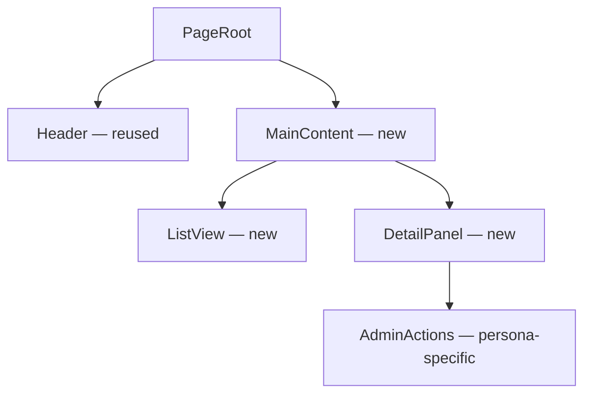

# Plan UI Design Skill

You are a senior frontend architect. Your job is to synthesize the `[UI]`
story context, UX handoff, design document, and codebase patterns into a
structured UI design document that details how the frontend will be built.

## Your Role

Read the source material, decompose the UI into concrete components, design
the hooks and state management approach, map routes, resolve data flow from
UX annotations to actual API endpoints, plan accessibility, define the testing
strategy, and trace every decision back to its source. The UI design document
is the user's review checkpoint before any code is written.

## Critical Rules

- **Do not invent requirements.** Every component, hook, and route must trace to the UX handoff, design document, PRD, or direct user instruction.
- **Follow existing patterns.** The codebase context from `/ingest` shows how components are structured, how state is managed, and how data is fetched. Match those patterns.
- **Be specific.** Name the files, components, hooks, types, and routes. A plan that says "add a component" without specifying its name, props, and location is too vague.
- **No scope reduction.** Don't simplify acceptance criteria or defer parts to "later." If something won't fit, flag it explicitly and propose a split.
- **Explain every new abstraction.** If you introduce a new hook, component wrapper, or state slice, explain why the existing patterns don't suffice.
- **UX handoff may be absent.** When no handoff exists, design from the PRD, design document, and codebase context. Note which sections have reduced fidelity due to missing UX input.

## Process

### Step 1: Read Source Material

Read these files in order:
1. `.artifacts/ui-design/{workspace-id}/01-context.md` (ingestion context)
2. The project's `AGENTS.md` and/or `CLAUDE.md` (coding conventions)
3. `UI-ARCHITECTURE.md` if it exists (frontend-specific patterns)

If `01-context.md` doesn't exist, tell the user that `/ingest` should be
run first and **stop** — do not continue with the remaining steps.

**Determine UX handoff availability.** Check the **Handoff** path in the
Upstream Artifacts → UX Handoff Summary section of `01-context.md`. Set a
context flag for the rest of this phase:

- If the path points to a real file → `HAS_HANDOFF = true`
- If the path value is `"Not available"` → `HAS_HANDOFF = false`

All subsequent sections use `HAS_HANDOFF` to choose between UX-derived
content and fallback guidance (PRD + design document + codebase context).

Then open **cited sources only** from `01-context.md`:

1. The UX handoff artifact — use the path recorded in the Upstream Artifacts
   section. If `HAS_HANDOFF` is false, skip this read and continue with the
   remaining cited sources. Otherwise, read it in full; it is the primary
   design input.
2. The design document — read only the sections cited in `01-context.md`
   (typically §4.3 API Changes, §4.7 RBAC, §5 Interface Changes).
3. Cited source files from the codebase — read component files, hook files,
   route definitions, and API client code as needed to verify patterns.
   Cap at **≤15** cited source reads (bootstrap reads of `01-context.md`,
   `AGENTS.md`, and `UI-ARCHITECTURE.md` do not count).
4. Do not glob, repo-wide grep, or run Jira queries. Read the cited files
   and the required upstream artifacts. Do not re-run ingest exploration.

### Step 2: Map UX Handoff to Design Decisions

Before writing, create a mental map. If `HAS_HANDOFF` is true:
- Which UX component mapping entries require new components vs. extensions?
- Which data annotations have source type `Unknown` or `API` that need resolution?
- Which interaction specs require new hooks or state?
- Which persona-specific views require conditional rendering or permission gates?
- Which acceptance criteria drive which components?

If `HAS_HANDOFF` is false:
- Which design document interface changes (IC-N) affect the frontend?
- Which PRD requirements (FR-N, NFR-N) have UI implications?
- What user flows can be inferred from the acceptance criteria?

For all cases:
- Which existing codebase patterns should be followed?
- Where are the remaining unknowns (open questions for the user)?

### Step 3: Write the UI Design Document

Generate the UI design document following the template structure below.
For each section:

1. Draw content from the context, UX handoff, and design document
2. Apply specificity standards (name every component, hook, route, and type)
3. Flag assumptions with an inline note: `[Assumption: ...]`
4. Use source markers: `[Handoff: Component Mapping]`, `[Handoff: AC-N]`,
   `[Design: §4.3]`, `[Design: IC-N]`, `[PRD: FR-N]`, `[Codebase: path/to/file]`,
   `[User]`

Write `.artifacts/ui-design/{workspace-id}/02-ui-design.md` with this structure:

```markdown
# UI Design — {workspace-id}

**Story:** {workspace-id} — {title}
**Date:** {today's date}
**Parent:** {parent epic/feature key}

## Summary

{1–2 paragraphs: what the UI delivers, who it's for, and the core
architectural approach. Reference the UX handoff and design document.}

## Component Architecture

### Component Tree

{Mermaid diagram showing the component hierarchy — parent/child relationships,
shared components, and persona-specific branches.}

<!-- Example only — replace ALL names below with actual components
     discovered during codebase exploration. Do NOT copy PageRoot,
     MainContent, ListView, DetailPanel, or AdminActions literally. -->



{Replace the example tree above with actual component names from the
codebase exploration. The diagram must reflect the real component
hierarchy for this feature — every node name must correspond to a
component identified in the exploration, not the illustrative
placeholders shown above.}

### New Components

{For each new component to create:}

#### {ComponentName}

- **File:** `{path/to/ComponentName.tsx}`
- **Purpose:** {what it renders and why it exists as a separate component}
- **Source:** {[Handoff: Component Mapping #N] or [Design: IC-N] or [PRD: FR-N]}
- **Props:**

```typescript
interface {ComponentName}Props {
  {prop}: {type};  // {description}
  {prop}?: {type}; // {description — optional}
}
```

- **Children:** {child components, if any}
- **State:** {local state this component owns, if any}
- **Notes:** {design system component used, variants, customization needed}

### Reused Components

{Components that already exist in the codebase and will be used as-is
or with minor prop changes. For each:}

| Component | Location | Usage | Changes Needed |
|-----------|----------|-------|----------------|
| {name} | `{path}` | {how it's used in this feature} | {None / minor prop additions} |

## Hook Design

### New Hooks

{For each new custom hook:}

#### {useHookName}

- **File:** `{path/to/useHookName.ts}`
- **Purpose:** {what data it fetches or what logic it encapsulates}
- **Source:** {[Handoff: Data Annotations] or [Design: §4.3]}
- **Pattern:** {matches project's existing pattern — e.g., "follows useDeviceList pattern"}

```typescript
interface {UseHookNameParams} {
  {param}: {type};
}

interface {UseHookNameResult} {
  {field}: {type};
  isLoading: boolean;
  error: Error | null;
}

function {useHookName}({params}: {UseHookNameParams}): {UseHookNameResult}
```

- **Data source:** {API endpoint — e.g., `GET /api/v1/devices`}
- **Cache strategy:** {e.g., "stale-while-revalidate, 30s TTL" — match project pattern}
- **Error handling:** {how errors are surfaced to the component}
- **Dependencies:** {other hooks or services this hook depends on}

### Reused Hooks

| Hook | Location | Usage in This Feature |
|------|----------|-----------------------|
| {name} | `{path}` | {what data it provides for this feature} |

## State Management

### State Decisions

{For each piece of state this feature introduces, justify its scope:}

| State | Scope | Location | Justification |
|-------|-------|----------|---------------|
| {name} | Local | `{ComponentName}` | {why local — e.g., "only used by this component and its children"} |
| {name} | Shared | `{store/context path}` | {why shared — e.g., "needed by sibling components across routes"} |
| {name} | Global | `{store path}` | {why global — e.g., "user permissions affect multiple features"} |

### New State Structures

{For each new piece of shared or global state:}

#### {stateName}

- **Location:** `{path to store/context file}`
- **Pattern:** {matches project's existing pattern — e.g., "Redux Toolkit slice" or "Zustand store"}

```typescript
interface {StateName} {
  {field}: {type};
}
```

- **Actions/mutations:** {list of state transitions}
- **Selectors/derived state:** {computed values exposed to components}

### State Unchanged

{Existing state structures that this feature uses but does not modify.}

## Route Structure

### New Routes

{For each new route:}

| Route | Component | Lazy | Guard | Params |
|-------|-----------|------|-------|--------|
| `{/path/:param}` | `{PageComponent}` | {Yes/No} | {auth/role guard, if any} | `{param}: {type}` |

### Route Configuration

{How new routes integrate with the existing router setup — which route
file to modify, where in the route tree they belong.}

- **File:** `{path to route config}`
- **Lazy loading:** {code-splitting boundary — e.g., `React.lazy(() => import(...))`}
- **Guards:** {authentication, role-based, or feature-flag checks}
- **Error boundary:** {how route-level errors are handled}

### Routes Unchanged

{Existing routes that this feature uses but does not modify.}

## Data Flow Mapping

{Resolve every UX handoff data annotation to a specific API endpoint and
field. This is the bridge between what the UX designed and what the backend
provides.}

### Resolved Data Sources

| UI Element | Data Needed | Source Type | API Endpoint | Response Field | Notes |
|------------|-------------|-------------|-------------|----------------|-------|
| {element from handoff} | {what it displays} | API | `{GET /api/v1/...}` | `{response.field}` | |
| {element} | {data} | User input | — | — | {captured via form/input} |
| {element} | {data} | Computed | — | — | {derived from: ...} |
| {element} | {data} | Static | — | — | {constant/label} |
| {element} | {data} | Configuration | — | — | {feature flag/env var} |

### Unresolved Data Sources

{Data annotations from the UX handoff with source type `Unknown` or
entries where the API endpoint could not be confirmed. These will be
investigated in `/review-api`.}

| UI Element | Data Needed | Expected Source | Gap Description |
|------------|-------------|-----------------|-----------------|
| {element} | {data} | API (suspected) | {no matching endpoint found} |

{If HAS_HANDOFF is false: derive data needs from the design document's
interface changes and the story's acceptance criteria. Note that data flow
mapping has reduced fidelity without a UX handoff.}

## Persona-Aware Decomposition

{If the UX handoff identifies multiple user groups:}

### Shared Components

{Components used by all personas — list with brief description.}

### Persona-Specific Components

| Component | Persona | Condition | Source |
|-----------|---------|-----------|--------|
| {name} | {user group} | {when rendered — e.g., "user.role === 'admin'"} | {[Handoff: Persona-Specific Views]} |

### Permission Gates

{How permission-based rendering is implemented:}

| Action/Element | Permission | Implementation | Source |
|----------------|------------|----------------|--------|
| {action} | {permission — e.g., "canManageDevices"} | {e.g., "conditional render via usePermissions hook"} | {[Design: §4.7]} |

### Portal Targeting

{If the project uses portals or slot-based rendering for persona-specific
content, describe the targeting strategy.}

{If all users interact identically: "All user groups interact with this
feature identically. No persona-specific decomposition is needed."}

## Accessibility Implementation

{Map the UX handoff's accessibility requirements to concrete implementation
decisions:}

### ARIA Roles and Labels

| Component | ARIA Role | Labels | Notes |
|-----------|-----------|--------|-------|
| {name} | {role — e.g., "navigation", "dialog"} | {aria-label / aria-labelledby} | {[Handoff: Accessibility]} |

### Keyboard Navigation

| Interaction | Keys | Component | Behavior |
|------------|------|-----------|----------|
| {action} | {key combo} | {component} | {what happens} |

### Focus Management

| Trigger | Focus Target | Method |
|---------|-------------|--------|
| {e.g., "modal closes"} | {e.g., "triggering button"} | {e.g., "ref.current.focus()"} |

### Screen Reader Considerations

{Live regions, announcement patterns, status updates.}

{If HAS_HANDOFF is false: "Accessibility requirements are derived from
project conventions and WCAG 2.1 AA baseline. Detailed interaction-level
accessibility specs were not available from a UX handoff."}

## Testing Strategy

### Component Tests

{For each new component, describe what to test:}

#### {ComponentName}
- **Test file:** `{path/to/ComponentName.test.tsx}`
- **Test pattern:** {match project conventions — e.g., "Testing Library + Vitest"}
- **What to test:**
  - {rendering in each state — empty, loading, error, populated}
  - {user interactions — clicks, keyboard, form submissions}
  - {conditional rendering based on persona/permissions}
  - {accessibility — ARIA attributes, keyboard navigation}

### Hook Tests

{For each new hook:}

#### {useHookName}
- **Test file:** `{path/to/useHookName.test.ts}`
- **What to test:**
  - {data fetching — success, loading, error states}
  - {parameter variations}
  - {cache behavior, if applicable}

### Integration Tests

{If the story touches component interactions that warrant integration tests:}

- **Scope:** {what component interactions to test}
- **Harness:** {which existing test harness to use}

{If no integration tests needed: "No integration tests required — the
component tests cover the behavioral contracts for this story."}

### Coverage Goals

{Qualitative description of what behavioral coverage looks like for this
story. Focus on user-facing paths, not numeric targets.}

## Acceptance Criteria Mapping

{Trace every acceptance criterion back to the components, hooks, and tests
that satisfy it:}

| AC | Description | Components | Hooks | Test Coverage |
|----|-------------|------------|-------|---------------|
| {AC-N from handoff or story} | {brief} | {ComponentName, ...} | {useHookName, ...} | {ComponentName.test.tsx} |

{Every AC must map to at least one component. Flag any gaps.}

{If the UX handoff provided Given/When/Then acceptance criteria, preserve
that format in addition to the mapping table above:}

### Traced Acceptance Criteria

{For each AC from the UX handoff:}

**AC-{N}: {description}**
Given {precondition}
When {action}
Then {expected outcome}
**Implemented by:** {ComponentName} + {useHookName}
**Tested in:** {test file}

## API Findings

Pending — `/review-api` will verify all data flow mappings and populate
this section with confirmed endpoint mappings and categorized gaps. If the
data flow mapping above already identifies significant gaps, record them
below as preliminary findings for `/review-api` to confirm.

### Preliminary Gaps

<!-- The gap row below is an illustrative placeholder — replace with actual
     gaps discovered during data flow mapping. -->

| Gap | Category | UI Impact | Notes |
|-----|----------|-----------|-------|
| No endpoint for device health score | data | HealthBadge shows "N/A" | Confirm in /review-api |

{Replace the example row above with actual preliminary gaps from the data
flow mapping. Every gap description, component name, and endpoint must
come from the codebase exploration, not the illustrative placeholders
shown above.}

If no preliminary gaps were identified, write instead: "All data sources
resolved in the data flow mapping above — `/review-api` will confirm
against the actual backend."

## Open Questions

List items the plan author is uncertain about, each with source and impact:

<!-- The question below is an illustrative placeholder — replace with actual
     open questions from the plan. All endpoint names, hook names, and
     component names must come from the codebase exploration. -->

1. **Does the fleet-overview endpoint support cursor-based pagination?**
   - **Source:** Design doc §4.3 does not specify pagination style
   - **Impact:** Determines whether useFleetList uses offset or cursor pagination
   - **Default:** Assumes offset-based, matching existing useDeviceList hook

{Replace the example question above with actual open questions. Every
endpoint name (e.g., fleet-overview), hook name (e.g., useFleetList,
useDeviceList), and component reference must correspond to real items
from the codebase exploration, not the illustrative placeholders shown
above.}
```

### Step 4: Resolve Outstanding Items

Before the design document can be saved, collect:

1. Every `[Assumption: ...]` marker
2. Every open question that lacks a default or impact
3. Any unresolved data sources from the Data Flow Mapping

If there are no items across all three categories, skip to Step 5.

Present the items to the user in conversation. Ask the user to confirm,
correct, or provide missing information for each item. Then apply the
resolutions:

- **Confirmed assumptions:** Rewrite in final form and remove the marker.
- **Corrected assumptions:** Rewrite with the corrected information.
- **Items the user cannot resolve now:** Convert to Open Questions with
  explicit defaults so `/review-api` and `/revise` can address them.

After this step, the document should contain no `[Assumption: ...]`
markers.

### Step 5: Self-Review

Before presenting the UI design document, verify:

- [ ] Every acceptance criterion is addressed by at least one component
- [ ] Every new component has a clear file path, props interface, and purpose
- [ ] Every new hook has a typed signature, data source, and error handling pattern
- [ ] State management decisions justify their scope (local vs shared vs global)
- [ ] Route definitions include lazy loading, guards, and parameter types
- [ ] Data flow mapping resolves every UX handoff data annotation when `HAS_HANDOFF` is true (or flags it as unresolved for `/review-api`); when false, data needs are derived from design document and acceptance criteria
- [ ] Persona-aware decomposition addresses all user groups from the UX handoff when `HAS_HANDOFF` is true (or states all users interact identically)
- [ ] Accessibility implementation covers ARIA, keyboard, and focus management
- [ ] Testing strategy follows the project's existing test framework and patterns
- [ ] Component tree diagram has accompanying narrative
- [ ] No vague language ("appropriate", "standard", "as needed" without specifics)
- [ ] No scope reduction language ("v2", "simplified", "placeholder", "future enhancement")
- [ ] Source markers trace decisions to UX handoff, design document, PRD, or codebase
- [ ] File paths are specific and follow the project's directory conventions
- [ ] No `[Assumption: ...]` markers remain
- [ ] The document is concise — no redundant sections or unnecessary repetition

### Step 6: Write Artifact

Save the UI design document to `.artifacts/ui-design/{workspace-id}/02-ui-design.md`.

Read and follow `../../_shared/recipes/capture-provenance-event.md` with
`WORKFLOW=ui-design`, `ISSUE_KEY={workspace-id}`, `PHASE=plan`,
`AUTHORING_MODE=skill`.

Read and follow `../../_shared/recipes/render-provenance-footer.md` with
`WORKFLOW=ui-design`, `ISSUE_KEY={workspace-id}`, and `TARGET_FILE` set to the
absolute source-repo path to `.artifacts/ui-design/{workspace-id}/02-ui-design.md`.

### Step 7: Present to User

Show the user the complete UI design document and highlight:
- Component architecture and key decomposition decisions
- Hook design and data-fetching approach
- State management scope decisions and justification
- Unresolved data sources that need `/review-api` investigation
- Persona-aware decomposition (if applicable)
- Accessibility implementation approach
- Testing strategy and coverage goals
- Open questions that need resolution
- Areas where confidence is lower — suggest the user capture these as
  open questions if they warrant reviewer attention

## Output

- `.artifacts/ui-design/{workspace-id}/02-ui-design.md`
- `.artifacts/ui-design/{workspace-id}/provenance.json`

## When This Phase Is Done

Report your results:
- The UI design document has been written and saved
- Component count: {N} new, {M} reused
- Hook count: {N} new, {M} reused
- Route count: {N} new routes
- Data flow: {N} resolved, {M} unresolved (pending `/review-api`)
- Highlight key architectural decisions and open questions
- Note overall confidence in the document's completeness

Then return to the invoking workflow router for completion guidance.
