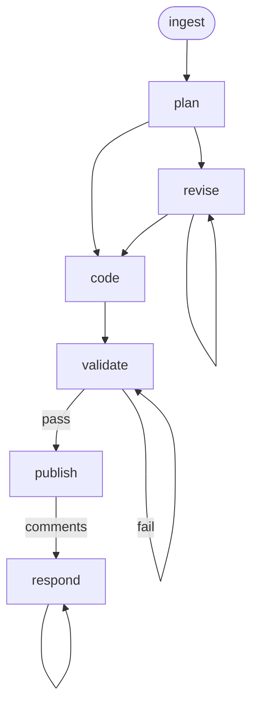

# UI Implement Workflow

A story-to-code workflow for UI/front-end stories. Takes a Jira [UI] Story, plans the implementation using discovered design-system and testing conventions, writes contract-based unit tests and production code via TDD, validates against the project's CI expectations, and manages review via GitHub PRs.

## Phase Flow



## Prerequisites

| Tool | Required | Purpose |
|------|----------|---------|
| Jira access (MCP or CLI) | For `/ingest` | Fetch Story issue details |
| GitHub CLI (`gh`) | For `/publish`, `/respond` | Create PRs, post review comments |
| Git | Yes | Branch management, commits |
| Project build/test tooling | Yes | Discovered during `/ingest` from project's AGENTS.md, package.json, CI workflows |
| Docs repo (local clone) | For `/ingest` | Read ui-design, PRD, handoff, and API findings documents |

## Phases

| Phase | Command | Purpose | Artifact(s) |
|-------|---------|---------|-------------|
| Ingest | `/ingest` | Fetch story, load ui-design/PRD/handoff context, discover UI toolchain | `01-context.md`, `testplan.md` (when test cases match) |
| Plan | `/plan` | Design implementation approach, component/hook interfaces, test strategy | `02-plan.md` |
| Revise | `/revise` | Incorporate feedback into the plan | Updated `02-plan.md` |
| Code | `/code` | Write unit tests and code via TDD, then integration/e2e stubs | `03-test-report.md`, `04-impl-report.md` |
| Validate | `/validate` | Run tests, lint, type checking, coverage analysis | `05-validation-report.md` |
| Publish | `/publish` | Push branch, create draft PR | `06-pr-description.md` |
| Respond | `/respond` | Address reviewer comments | `07-review-responses.md` |

Each phase command invokes `skills/dispatch.md` with the requested phase. The
dispatcher resolves any project override, loads only that phase, and passes
along the command context. After the phase reports its result,
`skills/completion.md` supplies the shared next-step guidance without loading
the full controller. The controller remains the entry point for workflow
discovery and ambiguous requests.

## Typical Flow

```text
/ingest EDM-1234
  → fetches story from Jira
  → loads ui-design document, design document, PRD, handoff, API findings
  → explores affected components and UI codebase areas
  → discovers UI toolchain (test framework, design system, i18n, state management)
  → discovers validation profile (build, test, lint, type-check commands)
  → writes .artifacts/ui-implement/EDM-1234/01-context.md
  → writes testplan.md when story test cases match

/plan
  → designs implementation approach
  → defines component props and hook signatures (the contracts)
  → plans unit test strategy per component/hook
  → plans integration/e2e test stubs (if e2e framework exists)
  → plans UI cross-cutting concerns (design system, i18n, a11y, permissions, states)
  → breaks work into ordered tasks
  → optionally includes Task 0 for test framework introduction
  → writes 02-plan.md

/revise (optional, repeatable)
  → user reviews plan, requests changes
  → plan updated, consistency maintained

/code
  → creates feature branch
  → for each task: write unit tests → write code → review → commit
  → after all tasks: write integration/e2e test stubs (if planned)
  → updates 02-plan.md with task completion status
  → writes 03-test-report.md, 04-impl-report.md

/validate
  → runs full validation suite (discovered during /ingest)
  → analyzes coverage for untested behavioral paths
  → verifies UI cross-cutting concerns (design system, i18n, a11y, states)
  → adds tests for gaps, fixes lint/type issues
  → writes 05-validation-report.md

/publish
  → pushes feature branch
  → creates draft GitHub PR with Jira link
  → writes 06-pr-description.md

/respond (repeatable)
  → fetches PR review comments
  → proposes responses (user approves before posting)
  → applies code changes if needed
  → writes 07-review-responses.md
```

## Artifacts

All artifacts are stored in `.artifacts/ui-implement/{issue-key}/`.

```text
.artifacts/ui-implement/EDM-1234/
  01-context.md              (story context, UI toolchain, validation profile)
  testplan.md                (story-scoped test cases, when ingest finds matches)
  02-plan.md                 (task breakdown, test strategy — updated as tasks complete)
  03-test-report.md          (tests written, contracts covered)
  04-impl-report.md          (changes, commits, UI concerns applied, deviations)
  05-validation-report.md    (check results, coverage, UI cross-cutting verification)
  06-pr-description.md       (PR body)
  07-review-responses.md     (review comment log)
  publish-metadata.json      (PR number, branch, URL)

.artifacts/ui-implement/
  _validation-profile.md     (discovered build/test/lint commands, cached across stories)
  .meta.json                 (file hashes/mtimes for validation cache invalidation)
```

## Key Design Decisions

### Contract-Based Testing (TDD for Unit Tests)

Unit tests validate behavioral contracts through public interfaces:
- **Components:** Test rendered output, user interactions, accessibility attributes
- **Hooks:** Test return values, state transitions, side effects
- Tests should remain valid if the implementation were rewritten
- Unit tests use TDD: write tests first, then implementation, task by task

### Integration/E2E Test Stubs (Post-Implementation)

Integration and e2e test stubs are written **after** all implementation tasks complete:
- Stubs follow the project's existing e2e patterns (if any)
- They provide scaffolding (describe blocks, pending tests) — not full implementations
- Full e2e test suites are the responsibility of `[QE]` stories

### Discovery-Based Everything

The workflow does not hardcode any tool assumptions. During `/ingest`, it discovers:
- Test framework (Vitest, Jest, Mocha, etc.)
- Design system (PatternFly, MUI, Chakra, custom, etc.)
- i18n library (react-i18next, react-intl, FormatJS, etc.)
- State management approach
- Routing library
- E2e framework (Cypress, Playwright, etc.)
- Permission/RBAC patterns
- Build, test, lint, and type-check commands

If the project adds new tools or changes conventions, the next `/ingest` picks them up.

### Test Framework Introduction

When `/ingest` discovers no unit testing framework exists:
- It identifies suitable frameworks based on the project's build tooling
- Records a recommendation in `01-context.md`
- `/plan` includes this as "Task 0: Introduce unit testing framework"
- The user approves the framework choice before any story code is written

### Upstream Design Documents

This workflow reads published docs from the docs repo, never from another
workflow's `.artifacts/` directory:
- `ui-design-{workspace-id}.md` — **required** — component architecture, hook designs, state management, accessibility plan
- `handoff.md` — **optional** — interaction specs, state matrix, acceptance criteria enrichment
- `api-findings-{workspace-id}.md` — **optional** — resolved endpoints, API gaps
- `prd.md` — requirements coverage
- `design.md` — API contracts, data models

### UI Cross-Cutting Concerns

Every `/code` task and `/validate` review checks:
- **Design system compliance** — use design system components, not raw HTML
- **i18n** — wrap all user-visible strings
- **Accessibility** — ARIA attributes, keyboard navigation, screen reader text
- **Permission-aware rendering** — use discovered RBAC patterns
- **State completeness** — loading, error, and empty states

### What This Workflow Does NOT Do

- Full e2e test suites (those are for `[QE]` stories via the `e2e` workflow)
- Visual regression tests
- Backend implementation (that's the `implement` workflow for `[DEV]` stories)

## Directory Structure

```text
ui-implement/
├── SKILL.md                    # Workflow entry point
├── guidelines.md               # Behavioral rules and guardrails
├── README.md                   # This file
├── templates/
│   ├── 01-context.md           # Ingest context skeleton
│   └── story-testplan.md       # Story-scoped testplan skeleton
├── skills/
│   ├── controller.md           # Discovery and ambiguous-input router
│   ├── dispatch.md             # Explicit-phase dispatcher
│   ├── completion.md           # Shared next-step guidance
│   ├── ingest.md               # Fetch story, discover UI toolchain, explore codebase
│   ├── plan.md                 # Design implementation approach
│   ├── revise.md               # Incorporate plan feedback
│   ├── code.md                 # Write tests and code via TDD, then stubs
│   ├── validate.md             # Run validation suite
│   ├── publish.md              # Create GitHub PR
│   └── respond.md              # Address review comments
└── commands/
    ├── ingest.md               # /ingest command
    ├── plan.md                 # /plan command
    ├── revise.md               # /revise command
    ├── code.md                 # /code command
    ├── validate.md             # /validate command
    ├── publish.md              # /publish command
    └── respond.md              # /respond command
```

## Getting Started

```bash
# Install the workflow
./install.sh claude --packages ui-implement

# Or install all workflows
./install.sh all
```

Then in your project, run the `ui-implement` workflow's `ingest` command for your Jira story (e.g., EDM-1234).
