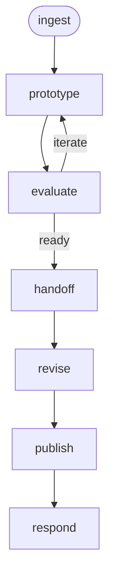

# UX Design Workflow

A UX design workflow that takes a feature request through discovery, prototyping, and heuristic evaluation to produce a validated design handoff artifact for implementation.

## Phase Flow



## Prerequisites

| Tool | Required | Purpose |
|------|----------|---------|
| Jira access (MCP or CLI) | Conditional | Required for Jira input, not for feature descriptions |
| UXD marketplace plugins | Optional | Graceful degradation when unavailable |

## Phases

| Phase | Command | Purpose | Artifact(s) |
|-------|---------|---------|-------------|
| Ingest | `/ingest` | Frame the problem, identify user groups, survey landscape | `01-discovery.md` |
| Prototype | `/prototype` | Generate design prototypes from discovery | `02-prototype/` |
| Evaluate | `/evaluate` | Heuristic evaluation and usability assessment | `03-evaluation.md` |
| Handoff | `/handoff` | Produce implementation-ready design spec | `04-handoff.md` |
| Revise | `/revise` | Incorporate stakeholder feedback on the handoff spec | `04-handoff.md` (updated) |
| Publish | `/publish` | Push handoff spec as a PR to the docs repo | `05-pr-description.md`, `publish-metadata.json`, PR in docs repo |
| Respond | `/respond` | Fetch and address PR reviewer comments | `04-handoff.md` (updated) |

## Typical Flow

```text
/ingest EDM-1234
  → frames the problem, identifies user groups
  → surveys competitive landscape
  → writes .artifacts/ux-design/EDM-1234/01-discovery.md

/prototype
  → generates design prototypes informed by discovery
  → uses uxd-prototype-create skill when available
  → writes 02-prototype/ (files + prototype-notes.md)

/evaluate
  → runs heuristic evaluation against prototype
  → uses uxd-research-heuristic-eval skill when available
  → writes 03-evaluation.md
  → loops back to /prototype if critical issues found

/handoff
  → synthesizes all artifacts into implementation spec
  → maps UI elements to design system components
  → writes 04-handoff.md

/revise
  → incorporates stakeholder feedback on the handoff spec
  → maintains consistency across all artifacts

/publish
  → pushes handoff spec as a PR to the docs repo
  → creates a draft PR for external review

/respond
  → fetches and addresses PR reviewer comments
  → updates handoff spec and docs repo copy
```

## Artifacts

All artifacts are stored in `.artifacts/ux-design/{issue-key}/`.

```text
.artifacts/ux-design/EDM-1234/
  01-discovery.md              (problem framing, user groups, landscape)
  02-prototype/                (prototype files, design rationale)
    prototype-notes.md         (design decisions, user stories covered)
  03-evaluation.md             (heuristic eval report, readiness assessment)
  04-handoff.md                (implementation spec, component mapping, AC)
  05-pr-description.md         (PR body for docs repo review)
  publish-metadata.json        (PR number, branch, file paths)
```

## UXD Marketplace Skills

This workflow uses skills from the [UXD AI Skills marketplace](https://github.com/rh-uxd/ai-helpers). All skills degrade gracefully — the workflow functions without them.

| Skill | Plugin | Used by |
|-------|--------|---------|
| `uxd-discovery` | `uxd-workshop` | `/ingest` |
| `uxd-design-handoff` | `uxd-workshop` | `/handoff` |
| `uxd-research-heuristic-eval` | `uxd-workshop` | `/evaluate` |
| `uxd-evaluate-design-heuristics` | `uxd-workshop` | `/evaluate` |
| `uxd-prototype-evaluate` | `uxd-workshop` | `/evaluate` |
| `uxd-prototype-create` | `uxd-workshop` | `/prototype` |
| `uxd-figma-read` | `uxd-workshop` | `/prototype` |

## Directory Structure

```text
ux-design/
├── SKILL.md                    # Workflow entry point
├── guidelines.md               # Behavioral rules and guardrails
├── README.md                   # This file
├── skills/
│   ├── controller.md           # Phase dispatcher and transitions
│   ├── ingest.md               # Frame problem, identify user groups
│   ├── prototype.md            # Generate design prototypes
│   ├── evaluate.md             # Heuristic evaluation
│   ├── handoff.md              # Design-to-implementation spec
│   ├── revise.md               # Incorporate feedback on handoff spec
│   ├── publish.md              # Push handoff spec to docs repo
│   └── respond.md              # Address PR reviewer comments
└── commands/
    ├── ingest.md               # /ingest command
    ├── prototype.md            # /prototype command
    ├── evaluate.md             # /evaluate command
    ├── handoff.md              # /handoff command
    ├── revise.md               # /revise command
    ├── publish.md              # /publish command
    └── respond.md              # /respond command
```

## Getting Started

```bash
# Install the workflow
./install.sh claude --workflows ux-design

# Or install all workflows
./install.sh all
```

Then in your project, run the `ux-design` workflow's `ingest` command for your Jira issue or feature description.
