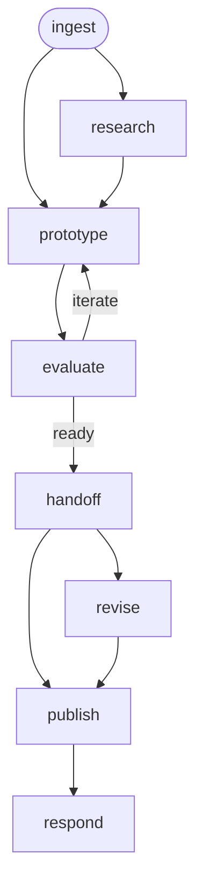

# UX Design Workflow

A UX design workflow that takes a feature request through discovery, user
research, prototyping, and heuristic evaluation to produce a validated
design handoff artifact for the `ui-design` workflow.

## Phase Flow



Research is conditional — skip directly to `/prototype` if the researcher
already has validated data or well-understood user needs.

## Prerequisites

| Tool | Required | Purpose |
|------|----------|---------|
| Jira access (MCP or CLI) | For `/ingest` | Fetch issue details for problem framing |
| UXD marketplace plugins | Optional | Enhances `/ingest`, `/prototype`, `/evaluate`, `/handoff` |

## Phases

| Phase | Command | Purpose | Artifact(s) |
|-------|---------|---------|-------------|
| Ingest | `/ingest` | Frame the problem, identify user groups, survey landscape | `01-discovery.md` |
| Research | `/research` | Conduct user research, synthesize findings | `02-research.md` |
| Prototype | `/prototype` | Generate design prototypes from research | `03-prototype/` |
| Evaluate | `/evaluate` | Heuristic evaluation and usability assessment | `04-evaluation.md` |
| Handoff | `/handoff` | Produce implementation-ready design spec | `05-handoff.md` |
| Revise | `/revise` | Incorporate stakeholder feedback | `05-handoff.md` (updated) |
| Publish | `/publish` | Push handoff spec to docs repo for review | PR in docs repo |
| Respond | `/respond` | Address PR reviewer comments | Updated `05-handoff.md` |

## Typical Flow

```text
/ingest EDM-1234
  → frames the problem, identifies user groups
  → surveys competitive landscape
  → writes .artifacts/ux-design/EDM-1234/01-discovery.md

/research                          (conditional — skip if you have data)
  → conducts user research
  → synthesizes findings into themed insights
  → documents persona-specific needs
  → writes 02-research.md

/prototype
  → generates design prototypes informed by research
  → writes 03-prototype/ (files + prototype-notes.md)

/evaluate
  → runs heuristic evaluation against prototype
  → writes 04-evaluation.md
  → loops back to /prototype if critical issues found

/handoff
  → synthesizes all artifacts into implementation spec
  → maps UI elements to design system components
  → annotates data requirements per UI element
  → documents persona-specific views
  → writes 05-handoff.md

/publish
  → pushes 05-handoff.md to docs repo
  → opens PR for team review

/respond
  → addresses PR review comments
  → updates 05-handoff.md as needed
```

## Artifacts

All artifacts are stored in `.artifacts/ux-design/{issue-key}/`.

```text
.artifacts/ux-design/EDM-1234/
  01-discovery.md              (problem framing, user groups, landscape)
  02-research.md               (research findings, insights, recommendations)
  03-prototype/                (prototype files, design rationale)
    prototype-notes.md         (design decisions, user stories covered)
  04-evaluation.md             (heuristic eval report, readiness assessment)
  05-handoff.md                (implementation spec, component mapping, AC)
```

## Handoff Contract

`05-handoff.md` is the primary artifact consumed by the `ui-design` workflow.
It contains:

- **Component mapping** — UI elements mapped to design system components
- **Interaction specs** — every user interaction documented
- **State enumeration** — empty, loading, error, populated, responsive
- **Data annotations** — what data each UI element needs (with gaps flagged)
- **Persona-specific views** — where user groups interact differently
- **Acceptance criteria** — testable, traced to research findings
- **Research context** — why decisions were made

## UXD Marketplace Skills

This workflow optionally uses skills from the
[UXD AI Skills marketplace](https://github.com/rh-uxd/ai-helpers).
All phases function without them — the skills enhance output quality
but are not required.

| Skill | Plugin | Used by |
|-------|--------|---------|
| `uxd-discovery` | `uxd-workshop` | `/ingest` |
| `uxd-prototype-create` | `uxd-workshop` | `/prototype` |
| `uxd-figma-read` | `uxd-workshop` | `/prototype` |
| `uxd-research-heuristic-eval` | `uxd-workshop` | `/evaluate` |
| `uxd-evaluate-design-heuristics` | `uxd-workshop` | `/evaluate` |
| `uxd-prototype-evaluate` | `uxd-workshop` | `/evaluate` |
| `uxd-design-handoff` | `uxd-workshop` | `/handoff` |

## Directory Structure

```text
ux-design/
├── SKILL.md                    # Workflow entry point
├── guidelines.md               # Behavioral rules and guardrails
├── README.md                   # This file
├── skills/
│   ├── controller.md           # Phase dispatcher and transitions
│   ├── ingest.md               # Frame problem, identify user groups
│   ├── research.md             # Conduct user research
│   ├── prototype.md            # Generate design prototypes
│   ├── evaluate.md             # Heuristic evaluation
│   ├── handoff.md              # Design-to-implementation spec
│   ├── revise.md               # Incorporate stakeholder feedback
│   ├── publish.md              # Push to docs repo PR
│   └── respond.md              # Address PR review comments
└── commands/
    ├── ingest.md               # /ingest command
    ├── research.md             # /research command
    ├── prototype.md            # /prototype command
    ├── evaluate.md             # /evaluate command
    ├── handoff.md              # /handoff command
    ├── revise.md               # /revise command
    ├── publish.md              # /publish command
    └── respond.md              # /respond command
```

## Getting Started

```bash
# Install the workflow
./install.sh claude --workflows ux-design

# Or install all workflows
./install.sh all
```

Then in your project, run `/ingest` with a Jira issue key or feature
description to begin.
