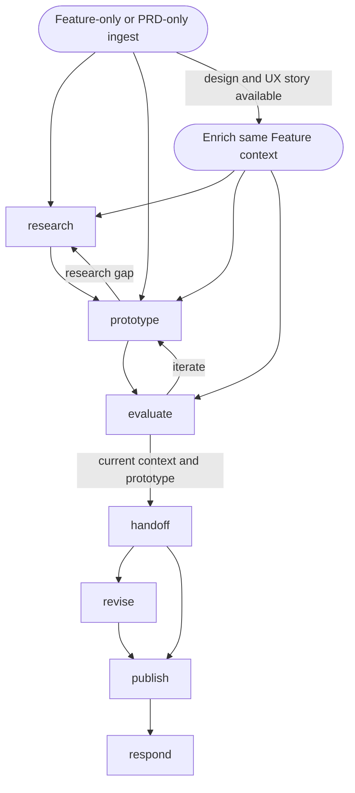

# UX Design Workflow

A UX design workflow that supports early research and exploratory prototypes
from a Jira Feature or a published PRD path, then enriches that context from
the design document and linked `[UX]` story. Feature-only and PRD-only work can
iterate through research, prototyping, and evaluation. It cannot produce the
implementation handoff consumed by `ui-design` until all required inputs and
the active design have been reviewed.

## Phase Flow


```mermaid
graph TD
    early_ingest([Feature-only or PRD-only ingest]) --> research
    early_ingest --> prototype
    research --> prototype
    prototype --> evaluate
    evaluate -->|iterate| prototype
    prototype -->|research gap| research
    early_ingest -->|design and UX story available| enrich([Enrich same Feature context])
    enrich --> research
    enrich --> prototype
    enrich --> evaluate
    evaluate -->|current context and prototype| handoff
    handoff --> revise
    handoff --> publish
    revise --> publish
    publish --> respond
```

Research is conditional — skip directly to `/prototype` if the researcher
already has validated data or well-understood user needs. Feature-only and
PRD-only work is exploratory; re-ingest when the design document and linked
`[UX]` story are available. Reconcile prior work and evaluate the active
prototype against the enriched context before handoff.

## Prerequisites

| Tool | Required | Purpose |
|------|----------|---------|
| Jira access (MCP or CLI) | For Jira-backed `/ingest` | Fetch a Feature or `[UX]` story; direct PRD-path ingestion does not fetch Jira content |
| Published PRD (`prd.md`) | For PRD-path `/ingest` or later context enrichment | Load product requirements before the design document exists |
| Published design doc (`design.md`) | For handoff context enrichment | Load technical constraints and data/API context |
| UXD Research, Prototype, and Design plugins | Required | Discovery, prototyping, evaluation, and handoff skills |
| Jira access (Atlassian MCP) | For Full `/evaluate` | `uxd-prototype-evaluate` fetches story acceptance criteria |
| `python3`, Node/npm, and Playwright Chromium | For Full `/evaluate` | Prototype evaluation helper scripts and browser walkthroughs |

`/ingest` loads upstream inputs from **shared** locations (Jira and the
published docs repo or an explicitly supplied published PRD path) — never from
another workflow's private `.artifacts/`. Missing documents are recorded as
gaps during exploratory work. `/handoff` requires the PRD, design document,
and linked `[UX]` story to be ingested.

## Phases

| Phase | Command | Purpose | Artifact(s) |
|-------|---------|---------|-------------|
| Ingest | `/ingest` | Start from a Feature or published PRD path, or enrich its context from a linked story and design document | `00-context.md`, `01-discovery.md` |
| Research | `/research` | Conduct user research, synthesize findings | `02-research.md` |
| Prototype | `/prototype` | Generate design prototypes from research | `03-prototype/` |
| Evaluate | `/evaluate` | Heuristic evaluation and usability assessment | `04-evaluation.md` |
| Design handoff | `/handoff` | Produce an implementation-ready spec after enriched context and current prototype evaluation | `05-handoff.md` |
| Revise | `/revise` | Incorporate stakeholder feedback | `05-handoff.md` (updated) |
| Publish | `/publish` | Push handoff spec to docs repo for review | `06-pr-description.md`, `publish-metadata.json`, PR in docs repo |
| Respond | `/respond` | Address PR reviewer comments | Updated `05-handoff.md` |

## Typical Flow

```text
/ingest EDM-Feature
  → loads the Feature issue without requiring a PRD or design document
  → frames the problem, identifies user groups, and records assumptions
  → writes exploratory context under .artifacts/ux-design/EDM-Feature/

Alternative when the PRD exists before the design document:
/ingest "path/to/published/feature-directory/prd.md"
  → uses the Feature key found in PRD metadata or the parent directory
    (or asks for the Feature key to use as the stable context key)
  → reads only that PRD; records design and UX story as not ingested
  → writes an exploratory discovery brief under the same Feature-scoped path

/research                          (conditional — skip if you have data)
  → conducts user research
  → synthesizes findings into themed insights
  → documents persona-specific needs
  → records the discovery revision that framed the work

/prototype
  → creates an exploratory prototype informed by research
  → records the discovery revision and prototype iteration

/evaluate
  → evaluates the active prototype against its discovery revision
  → writes 04-evaluation.md
  → loops to /prototype or /research as findings require

/ingest EDM-UX
  → resolves the linked Feature key and reuses its existing artifact directory
  → loads the design document, story references, and sibling stories
    (and the PRD if it was not already ingested)
  → preserves the prior context and assesses which research/prototype findings
    remain applicable
  → updates 01-discovery.md with the enriched context revision

/research, /prototype, /evaluate
  → reconcile earlier evidence and design decisions with the enriched context
  → preserve earlier research, prototypes, and evaluations in history

/handoff
  → proceeds only when PRD, design document, and linked [UX] story are ingested
    and the active prototype and evaluation match the current context revision
  → synthesizes current artifacts into implementation spec
  → maps UI elements to design system components
  → annotates data requirements per UI element
  → documents persona-specific views
  → reality-checks the design against the technical design (final vision
    vs. MVP/phase-1 split when constraints require it)
  → writes 05-handoff.md

/publish
  → pushes 05-handoff.md to docs repo
  → opens PR for team review

/respond
  → addresses PR review comments
  → updates 05-handoff.md as needed
```

## Artifacts

All artifacts are stored in `.artifacts/ux-design/{context-key}/`. For a
Jira-backed context, the Feature key is the stable context key, including when
later phases are invoked with the linked `[UX]` story. For a description-only
context, use the stable key agreed during `/ingest` (for example,
`description-<slug>`).

```text
.artifacts/ux-design/EDM-1234/
  00-context.md                (Feature/story links, revision, maturity, active bases)
  01-discovery.md              (current problem framing and upstream context)
  02-research.md               (research findings, insights, recommendations)
  03-prototype/                (mirrored skill output + design rationale)
    prototype-notes.md         (design decisions, user stories covered)
    prototype/                 (generated prototype files, from the skill)
  04-evaluation.md             (heuristic eval report, readiness assessment)
  04-eval-raw/                 (raw skill reports, mirrored from the eval skills)
  history/                     (prior context snapshots, prototypes, evaluations)
  05-handoff.md                (implementation spec, component mapping, AC)
  06-pr-description.md         (generated PR body for /publish)
  publish-metadata.json        (PR tracking: number, URL, branch, head SHA)
  provenance.json              (authoring provenance log)
```

## Contract for the handoff

`05-handoff.md` is the primary artifact consumed by the `ui-design` workflow.
It can be created only after `00-context.md` is `enriched`, `01-discovery.md`
contains the PRD and design document, and the linked `[UX]` story is recorded.
Its prototype must be reviewed against that discovery revision, and its
evaluation must cover the same revision and prototype iteration. Feature-only
or PRD-only research and prototypes remain useful inputs; they are never
sufficient on their own for this contract.

It contains:

- **Component mapping** — UI elements mapped to design system components
- **Interaction specs** — every user interaction documented
- **State enumeration** — empty, loading, error, populated, responsive
- **Data annotations** — what data each UI element needs (with gaps flagged)
- **Persona-specific views** — where user groups interact differently
- **Acceptance criteria** — testable, traced to research findings
- **Feasibility and phasing** — design reality-checked against the technical
  design, with a final-vision/MVP split when constraints require it
- **Research context** — why decisions were made

## UXD Marketplace Skills

This workflow uses skills from the
[UXD AI Skills repository](https://github.com/rh-uxd/ai-helpers). The installer
clones its current `main` branch and refreshes an existing clean checkout on
each run of `./install.sh`; it does not pin a commit. The upstream team will
notify us before breaking changes.

The installer links skill folders by bare name for Claude Code, Cursor, Gemini,
and Codex. Invoke the skill name directly rather than using a plugin-marketplace
namespace.

| Skill | Upstream plugin | Used by |
|-------|-----------------|---------|
| `uxd-discovery` | `uxd-research` | `/ingest` |
| `uxd-prototype-create` | `uxd-prototype` | `/prototype` |
| `uxd-prototype-export` | `uxd-prototype` | Optional export from prototype creation |
| `uxd-prototype-evaluate` | `uxd-prototype` | `/evaluate` (Full) |
| `uxd-prototype-publish` | `uxd-prototype` | Optional standalone publishing |
| `uxd-research-heuristic-eval` | `uxd-research` | `/evaluate` |
| `uxd-evaluate-design-heuristics` | `uxd-research` | `/evaluate` |
| `uxd-design-handoff` | `uxd-design` | `/handoff` |
| `uxd-figma-read` | `uxd-design` | Optional standalone use; prototype creation reads Figma links directly |

**Runtime paths:** Some upstream skills use `CLAUDE_SKILL_DIR` and
`CLAUDE_PLUGIN_ROOT` to locate scripts or plugin resources. Claude Code supplies
these variables. In other runtimes, resolve a skill under
`${HOME}/.uxd-ai-skills/plugins/<plugin>/skills/<skill>` and its plugin root at
`${HOME}/.uxd-ai-skills/plugins/<plugin>`. Supply the expected path to helpers
when needed. Full evaluation also requires Atlassian MCP access, Node/npm, and
Playwright Chromium; if those prerequisites are unavailable, do not silently
skip or downgrade the requested Full evaluation.

## Directory Structure

```text
ux-design/
├── SKILL.md                    # Workflow entry point
├── guidelines.md               # Behavioral rules and guardrails
├── README.md                   # This file
├── skills/
│   ├── controller.md           # Phase dispatcher and transitions
│   ├── ingest.md               # Frame problem, identify user groups
│   ├── research.md             # Conduct user research
│   ├── prototype.md            # Generate design prototypes
│   ├── evaluate.md             # Heuristic evaluation
│   ├── handoff.md              # Design-to-implementation spec
│   ├── revise.md               # Incorporate stakeholder feedback
│   ├── publish.md              # Push to docs repo PR
│   └── respond.md              # Address PR review comments
└── commands/
    ├── ingest.md               # /ingest command
    ├── research.md             # /research command
    ├── prototype.md            # /prototype command
    ├── evaluate.md             # /evaluate command
    ├── handoff.md              # /handoff command
    ├── revise.md               # /revise command
    ├── publish.md              # /publish command
    └── respond.md              # /respond command
```

## Getting Started

```bash
# Install the workflow
./install.sh claude --workflows ux-design

# Or install all workflows
./install.sh all
```

Then in your project, run `/ingest` with a Jira issue key or feature
description to begin.
